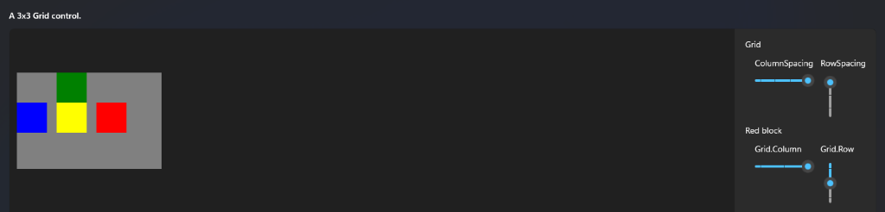
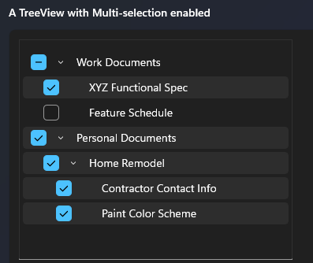
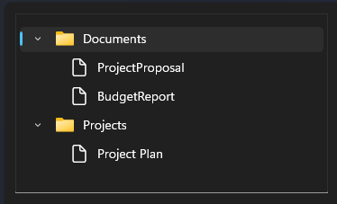

# Lienzo UI Markup Language

**Version:** 0.1
**Status:** Draft Specification

Lienzo UI Markup Language is a declarative UI language for Kotlin Native applications. It combines the simplicity of HTML-like syntax with a modern reactive runtime similar to Jetpack Compose and Slint.

---

# Table of Contents

1. [Introduction](#introduction)
2. [Basic Structure](#basic-structure)
3. [Layout Components](#layout-components)
4. [Navigation Components](#navigation-components)
5. [Data Components](#data-components)
6. [Tabs](#tabs)
7. [Input Components](#input-components)
8. [Display Components](#display-components)
9. [Containers](#containers)
10. [Advanced Layout](#advanced-layout)
11. [Styling](#styling)
12. [Data Binding](#data-binding)
13. [Events](#events)
14. [Conditional Rendering](#conditional-rendering)
15. [Loops](#loops)
16. [Components](#components)
17. [Resources](#resources)
18. [Complete Example](#complete-example)
19. [Project Structure](#project-structure)

---

# Introduction

A Lienzo UI application consists of one or more `.lienzo` files. Each file describes a window or reusable component using an HTML-like declarative syntax, backed by a Kotlin Native runtime.

```html
<Window
    title="My App"
    width="1200"
    height="800">

    <Column>

        <Text value="Hello World"/>

        <Button
            text="Click Me"
            onClick="showMessage"/>

    </Column>

</Window>
```

---

# Basic Structure

Every UI starts with a `Window`.

```html
<Window
    title="Application"
    width="1280"
    height="720">

    <!-- Content goes here -->

</Window>
```

## Window Attributes

| Property    | Type    | Description                                                 |
| ----------- | ------- | ----------------------------------------------------------- |
| title       | String  | Window title                                                |
| width       | Number  | Window width in px                                          |
| height      | Number  | Window height in px                                         |
| minWidth    | Number  | Minimum width in px                                         |
| minHeight   | Number  | Minimum height in px                                        |
| theme       | String  | Theme name                                                  |
| resizable   | Boolean | Allow resizing                                              |
| backdrop    | String  | Backdrop effect: `"none"`, `"mica"`, `"acrylic"`, `"tabbed"` |
| translucent | Boolean | Enable window opacity transparency/blend                    |

```html
<Window
    title="Dashboard"
    width="1400"
    height="900"
    backdrop="acrylic"
    translucent="true"
    theme="dark"/>
```

### Windows 11 Backdrop Effects (Mica & Acrylic)

To render modern Windows 11 materials like Mica and Acrylic, the native backend must hook into the Desktop Window Manager (DWM) attributes:

1. **Win32 Layered Window Style**:
   The window must be created or updated using `SetWindowLongPtr` to include `WS_EX_LAYERED` in its extended window style flags.

2. **DWM System Backdrop Attribute**:
   The window handles must invoke `DwmSetWindowAttribute` passing the `DWMWA_SYSTEMBACKDROP_TYPE` attribute ID (value `38`) with one of the following DWM backdrop type integers:
   - `DWMSBT_DISABLE` (1) for `"none"`
   - `DWMSBT_MAINWINDOW` (2) for `"mica"`
   - `DWMSBT_TRANSIENTWINDOW` (3) for `"acrylic"`
   - `DWMSBT_TABBEDWINDOW` (4) for `"tabbed"` (Mica Alt)

3. **Skia Render Context**:
   The Skia renderer's clear function must clear the canvas with a transparent color (e.g. `0x00000000u`) instead of drawing solid white or solid gray, enabling the DWM system blur backdrop to show through.

---

# Layout Components

Layout components control the positioning and flow of their children.

---

## Column

Arranges children vertically.

```html
<Column spacing="12">

    <Text value="Username"/>

    <TextBox/>

    <Button text="Login"/>

</Column>
```

### Properties

| Property | Type   | Description                     |
| -------- | ------ | ------------------------------- |
| spacing  | Number | Gap between children in px      |
| padding  | Number | Internal spacing in px          |
| grow     | Number | Flex grow factor                |
| align    | String | Alignment (`start`, `center`, `end`) |

---

## Row

Arranges children horizontally.

```html
<Row spacing="8">

    <Button text="Back"/>

    <Button text="Next"/>

</Row>
```

---

## Stack

Places components on top of each other (z-axis stacking).

```html
<Stack>

    <Image source="background.png"/>

    <Text value="Overlay Text"/>

</Stack>
```

---

## Grid

Creates advanced grid-based layouts with row and column definitions, spacing, and cell assignment using attached properties on child elements.



```html
<Grid
    Width="240"
    Height="120"
    Background="Gray"
    ColumnDefinitions="50, 50, 50"
    RowDefinitions="50, 50, 50"
    ColumnSpacing="16"
    RowSpacing="0">

    <Rectangle Fill="Red" Grid.Column="2" Grid.Row="1" />
    <Rectangle Fill="Blue" Grid.Row="1" />
    <Rectangle Fill="Green" Grid.Column="1" />
    <Rectangle Fill="Yellow" Grid.Column="1" Grid.Row="1" />

</Grid>
```

### Grid Properties

| Property | Type | Description |
| --- | --- | --- |
| ColumnDefinitions | String | Comma-separated list of widths for each column (e.g., `"50, 50, 50"` or `"Auto, *, 2*"`). |
| RowDefinitions | String | Comma-separated list of heights for each row (e.g., `"50, 50, 50"` or `"Auto, *, 2*"`). |
| ColumnSpacing | Number | Horizontal gap between columns in px. |
| RowSpacing | Number | Vertical gap between rows in px. |
| Background | String/Color | Background color of the grid. |

### Child / Attached Properties

These properties are specified on direct children of a `<Grid>` to define their cell position:

| Property | Type | Default | Description |
| --- | --- | --- | --- |
| Grid.Column | Number | `0` | The column index (0-indexed) where the element should be placed. |
| Grid.Row | Number | `0` | The row index (0-indexed) where the element should be placed. |

---

## Spacer

Consumes all available space, pushing sibling elements to the edges.

```html
<Row>

    <Text value="Left"/>

    <Spacer/>

    <Text value="Right"/>

</Row>
```

---

# Navigation Components

---

## Sidebar

Displays vertical navigation content.

```html
<Sidebar width="260">

    <NavItem text="Home"/>

    <NavItem text="Downloads"/>

</Sidebar>
```

---

## NavItem

A single navigation entry.

```html
<NavItem
    icon="download"
    text="Downloads"
    badge="15"/>
```

### Properties

| Property | Type    | Description                    |
| -------- | ------- | ------------------------------ |
| icon     | String  | Icon name from the icon set    |
| text     | String  | Display label                  |
| badge    | Number  | Notification badge count       |
| selected | Boolean | Whether this item is active    |

---

## Toolbar

A top action bar for primary actions.

```html
<Toolbar>

    <Button text="Open"/>

    <Button text="Save"/>

</Toolbar>
```

---

# Data Components

---

## Table

Displays tabular data from a bound collection.

```html
<Table items="{users}">

    <Column field="name" title="Name"/>

    <Column field="email" title="Email"/>

</Table>
```

### Properties

| Property  | Type       | Description                   |
| --------- | ---------- | ----------------------------- |
| items     | Collection | Bound data collection         |
| selection | Object     | Currently selected row        |

### Table Column

Defines a column within a `Table`.

```html
<Column
    field="name"
    title="Name"/>
```

---

## List

Displays a repeated template for each item in a collection.

```html
<List items="{messages}">

    <Template>

        <Text value="{item.subject}"/>

    </Template>

</List>
```

---

## TreeView

Displays hierarchical data as an interactive tree structure. Supports selection, multi-selection (including checkbox-based selection with tri-state support), icons, and node expansion/collapse.

### Visual Variations

| Multi-selection Enabled | Icon Support Enabled |
| --- | --- |
|  |  |

### Example Usage

```html
<TreeView
    items="{documents}"
    showCheckboxes="true"
    showIcons="true"
    selectionMode="multiple"
    onSelectionChange="handleSelection">

    <!-- Optional custom template for rendering individual nodes -->
    <Template>
        <Text value="{item.name}"/>
    </Template>

</TreeView>
```

### Properties

| Property          | Type       | Default    | Description                                                   |
| ----------------- | ---------- | ---------- | ------------------------------------------------------------- |
| items             | Collection | -          | Bound collection of hierarchical nodes                        |
| showCheckboxes    | Boolean    | `false`    | Whether to show selection checkboxes next to items            |
| showIcons         | Boolean    | `false`    | Whether to show icons next to node labels                     |
| selectionMode     | String     | `"single"` | Selection mode: `"none"`, `"single"`, or `"multiple"`         |
| onSelectionChange | Method     | -          | Event handler triggered when the selection changes            |
| onNodeExpand      | Method     | -          | Event handler triggered when a node is expanded               |
| onNodeCollapse    | Method     | -          | Event handler triggered when a node is collapsed              |

### TreeView Node Item Structure

The bound hierarchical collection is expected to expose the following fields on each node:
* `name`: String display label.
* `icon`: String name/path of the icon to display next to the node label (optional).
* `children`: Collection of sub-nodes (optional).
* `isExpanded`: Boolean control for node expansion.
* `isSelected`: Boolean or tri-state state for selection (useful for multi-selection).

---

# Tabs

---

## TabView

Container that manages multiple tab pages.

```html
<TabView>

    <Tab title="General">

        <Text value="General Settings"/>

    </Tab>

    <Tab title="Security">

        <Text value="Security Settings"/>

    </Tab>

</TabView>
```

---

## Tab

An individual tab page inside a `TabView`.

```html
<Tab title="General">

    <!-- Tab content -->

</Tab>
```

---

# Input Components

---

## Button

Triggers an action when clicked.

```html
<Button
    text="Save"
    onClick="save"/>
```

### Properties

| Property | Type    | Description              |
| -------- | ------- | ------------------------ |
| text     | String  | Button label             |
| icon     | String  | Optional icon name       |
| enabled  | Boolean | Whether button is active |
| onClick  | Method  | Handler function name    |

---

## TextBox

A single-line text input field.

```html
<TextBox bind="username"/>
```

---

## PasswordBox

A text input that masks its content.

```html
<PasswordBox bind="password"/>
```

---

## CheckBox

A toggleable checkbox.

```html
<CheckBox
    text="Remember Me"
    bind="remember"/>
```

---

## RadioButton

A mutually exclusive selection option.

```html
<RadioButton
    text="Option A"
    bind="selectedOption"/>
```

---

## ComboBox

A dropdown selection list.

```html
<ComboBox
    bind="country"
    items="{countries}"/>
```

---

## SearchBox

A text input optimized for search queries.

```html
<SearchBox
    placeholder="Search..."
    bind="query"/>
```

---

## Slider

A range slider for numeric input.

```html
<Slider
    min="0"
    max="100"
    bind="volume"/>
```

---

# Display Components

---

## Text

Renders a text string.

```html
<Text value="Hello World"/>
```

### Properties

| Property | Type   | Description              |
| -------- | ------ | ------------------------ |
| value    | String | Text content or binding  |
| color    | Color  | Text color               |
| size     | Number | Font size in px          |
| weight   | String | Font weight (`normal`, `bold`) |

---

## Image

Renders an image from a file path or URL.

```html
<Image source="logo.png"/>
```

---

## Icon

Renders a named icon from the application icon set.

```html
<Icon name="download"/>
```

---

## ProgressBar

Displays a progress indicator.

```html
<ProgressBar value="{progress}"/>
```

---

## Badge

Displays a small numeric badge.

```html
<Badge value="5"/>
```

---

# Containers

---

## Card

A surface container with default styling (elevation, rounded corners).

```html
<Card>

    <Text value="Downloads"/>

</Card>
```

---

## Group

Groups related inputs under a labeled section.

```html
<Group title="Network">

    <CheckBox text="Enable DHT"/>

</Group>
```

---

## Section

A labeled content section, typically used inside a `Sidebar`.

```html
<Section title="Status">

    <NavItem text="All"/>

</Section>
```

---

# Advanced Layout

---

## SplitPane

Splits the available area into two resizable panes.

```html
<SplitPane orientation="horizontal">

    <Sidebar/>

    <Content/>

</SplitPane>
```

### Properties

| Property    | Type                       | Description                         |
| ----------- | -------------------------- | ------------------------------------ |
| orientation | `horizontal` / `vertical`  | Split direction                      |
| ratio       | Number                     | Initial size ratio (e.g. `0.3`)      |

---

## Dock

Fills the window with docked zones: top, bottom, left, right, and center.

```html
<Dock>

    <DockTop>
        <Toolbar/>
    </DockTop>

    <DockLeft>
        <Sidebar/>
    </DockLeft>

    <DockCenter>
        <Editor/>
    </DockCenter>

    <DockBottom>
        <Console/>
    </DockBottom>

</Dock>
```

---

# Styling

Styles are applied via named classes.

```html
<Button
    text="Save"
    class="primary"/>
```

## Style Definition

Styles are declared using `<Style>` blocks, typically in a separate `.theme` file or at the top of a `.lienzo` file.

```html
<Style name="primary">

    bg="#2563eb"
    color="white"
    radius="8"
    padding="12"

</Style>
```

## Common Style Properties

| Property | Description                    |
| -------- | ------------------------------ |
| bg       | Background color               |
| color    | Text color                     |
| radius   | Border radius in px            |
| padding  | Internal spacing in px         |
| margin   | External spacing in px         |
| border   | Border definition              |
| shadow   | Shadow definition              |
| width    | Width in px or `%`             |
| height   | Height in px or `%`            |

---

# Data Binding

Bindings connect UI elements to ViewModel state using `{}` syntax.

```html
<Text value="{username}"/>
```

```kotlin
val username = state("John")
```

## Two-Way Binding

Use `bind` for inputs that both read and write state.

```html
<TextBox bind="username"/>
```

## Expressions

Bindings support simple expressions.

```html
<Text value="{firstName + ' ' + lastName}"/>
```

```html
<Text value="{downloads.size}"/>
```

---

# Events

Events connect UI interactions to Kotlin methods by name.

```html
<Button
    text="Save"
    onClick="save"/>
```

```kotlin
fun save() {
    // handle save
}
```

## Supported Events

| Event         | Description              |
| ------------- | ------------------------ |
| onClick       | Mouse click              |
| onDoubleClick | Double click             |
| onHover       | Pointer hover            |
| onFocus       | Element receives focus   |
| onBlur        | Element loses focus      |
| onKeyDown     | Key pressed              |
| onKeyUp       | Key released             |
| onChange      | Value changed            |

---

# Conditional Rendering

---

## If

Renders children only when the condition is truthy.

```html
<If condition="{isLoggedIn}">

    <Dashboard/>

</If>
```

## If / Else

```html
<If condition="{isLoggedIn}">

    <Dashboard/>

</If>

<Else>

    <LoginScreen/>

</Else>
```

---

# Loops

---

## For

Renders a template for each item in a collection. The current item is accessed via `{item}`.

```html
<For each="{users}">

    <Row>

        <Text value="{item.name}"/>

    </Row>

</For>
```

---

# Components

Lienzo supports defining reusable UI components in `.lienzo` files.

## Component Definition

```html
<Component name="UserCard">

    <Card>

        <Text value="{name}"/>

        <Text value="{email}"/>

    </Card>

</Component>
```

## Usage

Props are passed as attributes.

```html
<UserCard
    name="{user.name}"
    email="{user.email}"/>
```

---

# Resources

---

## Import

Imports a component from another `.lienzo` file.

```html
<Import src="components/UserCard.lienzo"/>
```

---

## Theme

Applies a theme from a `.theme` file.

```html
<Theme src="themes/Dark.theme"/>
```

---

# Complete Example

A full-featured torrent client UI demonstrating layouts, bindings, navigation, and data components.

```html
<Window
    title="Torrent Client"
    width="1400"
    height="900">

    <Row>

        <Sidebar width="260">

            <Section title="Status">

                <NavItem icon="list" text="All"/>

                <NavItem icon="download" text="Downloading"/>

                <NavItem icon="check" text="Completed"/>

            </Section>

        </Sidebar>

        <Column grow="1">

            <Toolbar>

                <Button text="Open" icon="folder"/>

                <Button text="Delete" icon="trash"/>

                <Spacer/>

                <SearchBox
                    placeholder="Search torrents..."
                    bind="filter"/>

            </Toolbar>

            <Table items="{torrents}">

                <Column field="name"     title="Name"/>

                <Column field="progress" title="Progress"/>

                <Column field="status"   title="Status"/>

            </Table>

            <TabView>

                <Tab title="General"/>

                <Tab title="Peers"/>

                <Tab title="Trackers"/>

                <Tab title="Content"/>

            </TabView>

        </Column>

    </Row>

</Window>
```

This example demonstrates the core concepts of Lienzo UI: declarative layouts, reactive bindings, reusable components, and platform-independent desktop UI development with Kotlin Native.

---

# Project Structure

The suggested project layout for a Lienzo UI framework implementation:

```
my-lienzo-app/

├── compiler/               # .lienzo → Kotlin codegen pipeline
│   ├── lexer/              # Tokenizes .lienzo source files
│   ├── parser/             # Builds a parse tree from tokens
│   ├── ast/                # Abstract Syntax Tree definitions
│   └── codegen/            # Generates Kotlin Native code from AST
│
├── runtime/                # Reactive UI runtime
│   ├── widgets/            # Built-in component implementations
│   ├── state/              # Reactive state primitives
│   ├── layout/             # Layout engine (Column, Row, Grid, etc.)
│   └── events/             # Event dispatch and handler wiring
│
├── renderer-skia/          # Skia-based rendering backend
│   ├── canvas/             # Drawing surface management
│   ├── text/               # Text shaping and rendering
│   └── painting/           # Shapes, borders, shadows, images
│
├── src/
│   └── ui/
│       ├── MainWindow.lienzo
│       └── components/
│           └── UserCard.lienzo
│
└── themes/
    ├── Light.theme
    └── Dark.theme
```
