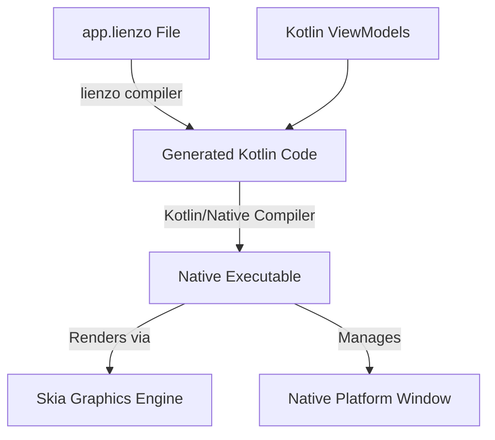

# lienzo ui Markup Language 
**Version:** 0.1
**Status:** Draft Specification

`lienzo ui` Markup Language is a declarative, HTML-like UI definition language designed for Kotlin/Native desktop applications. It combines the simplicity of HTML-like syntax with a modern reactive runtime and compilation model inspired by Jetpack Compose and Slint.

This document describes the syntax, components, styling, and reactive architecture of `.lienzo` files.

---

# Table of Contents

1. [Introduction](#introduction)
2. [Basic Structure & Window](#basic-structure--window)
3. [Layout Components](#layout-components)
4. [Navigation Components](#navigation-components)
5. [Data Components](#data-components)
6. [Tabs](#tabs)
7. [Input Components](#input-components)
8. [Display Components](#display-components)
9. [Containers](#containers)
10. [Advanced Layouts](#advanced-layouts)
11. [Styling & Theming](#styling--theming)
12. [Data Binding & Expressions](#data-binding--expressions)
13. [Events](#events)
14. [Conditional Rendering](#conditional-rendering)
15. [Loops](#loops)
16. [Custom Components](#custom-components)
17. [Resources & Imports](#resources--imports)
18. [Compilation & Runtime Architecture](#compilation--runtime-architecture)
19. [Suggested Project Structure](#suggested-project-structure)
20. [Complete Application Example](#complete-application-example)

---

# Introduction

A `lienzo ui` application consists of one or more declarative UI templates defined in `.lienzo` files, backed by Kotlin code-behind view models. 

At compile-time, the lienzo compiler (`lienzoc`) parses these `.lienzo` files and generates type-safe Kotlin/Native code. This generated code interfaces with the lienzo runtime, which uses Skia for platform-independent high-performance 2D rendering and GDI/Win32/Posix interfaces for native window management.



### Quick Example (`main.lienzo`)

```html
<Window
    title="Lienzo Quickstart"
    width="800"
    height="600">

    <Column spacing="16" padding="24">
        <Text value="Welcome to Lienzo UI" size="24" weight="bold"/>
        <Text value="A declarative UI engine for Kotlin Native." color="#6b7280"/>
        
        <Button
            text="Click Me"
            onClick="onButtonClicked"/>
    </Column>

</Window>
```

---

# Basic Structure & Window

Every lienzo application UI starts with a root `<Window>` component. The window defines the application frame, dimensions, native behavior, and global styling theme.

```html
<Window
    title="Application"
    width="1280"
    height="720"
    minWidth="640"
    minHeight="480"
    resizable="true"
    theme="dark">
    
    <!-- Application content layout goes here -->

</Window>
```

## Window Attributes

| Property | Type | Default | Description |
| :--- | :--- | :--- | :--- |
| `title` | `String` | `"Lienzo App"` | The title shown in the OS window title bar. |
| `width` | `Number` | `1024` | Initial width of the window in pixels. |
| `height` | `Number` | `768` | Initial height of the window in pixels. |
| `minWidth` | `Number` | `0` | Minimum allowable width when resizing. |
| `minHeight` | `Number` | `0` | Minimum allowable height when resizing. |
| `theme` | `String` | `"light"` | Active theme configuration name. |
| `resizable` | `Boolean` | `true` | Whether the user is allowed to resize the window. |

---

# Layout Components

Layout components are non-visual elements responsible for structuring, positioning, and sizing their children.

---

## Column

Arranges children sequentially in a vertical flow.

```html
<Column spacing="12" padding="16" align="center">
    <Text value="Username"/>
    <TextBox bind="username"/>
    <Button text="Login" onClick="handleLogin"/>
</Column>
```

### Properties

| Property | Type | Default | Description |
| :--- | :--- | :--- | :--- |
| `spacing` | `Number` | `0` | Pixel gap between adjacent items. |
| `padding` | `Number` | `0` | Outer padding around the inside boundaries of the Column. |
| `grow` | `Number` | `0` | Flex growth factor relative to siblings in a parent layout. |
| `align` | `String` | `"start"` | Alignment of children along the cross-axis (`"start"`, `"center"`, `"end"`, `"stretch"`). |

---

## Row

Arranges children sequentially in a horizontal flow.

```html
<Row spacing="8" padding="12" align="center">
    <Button text="Back" class="secondary"/>
    <Spacer/>
    <Button text="Next" class="primary"/>
</Row>
```

### Properties

| Property | Type | Default | Description |
| :--- | :--- | :--- | :--- |
| `spacing` | `Number` | `0` | Pixel gap between adjacent items. |
| `padding` | `Number` | `0` | Outer padding around the inside boundaries of the Row. |
| `grow` | `Number` | `0` | Flex growth factor relative to siblings in a parent layout. |
| `align` | `String` | `"start"` | Alignment of children along the cross-axis (`"start"`, `"center"`, `"end"`, `"stretch"`). |

---

## Stack

Places children directly on top of each other in the z-direction (layering). The last declared child is rendered on top of previous children.

```html
<Stack>
    <!-- Background Layer -->
    <Image source="background.png" width="800" height="400"/>
    
    <!-- Dark overlay layer -->
    <Card class="overlay-tint"/>
    
    <!-- Text Content on Top -->
    <Column padding="24" align="center">
        <Text value="Overlay Title" color="white" size="32"/>
        <Text value="Subtitle content on background" color="#d1d5db"/>
    </Column>
</Stack>
```

---

## Grid

Arranges components in a flexible two-dimensional grid layout.

```html
<Grid columns="3" spacing="16">
    <Card><Text value="Cell 1"/></Card>
    <Card><Text value="Cell 2"/></Card>
    <Card><Text value="Cell 3"/></Card>
    <Card><Text value="Cell 4"/></Card>
</Grid>
```

### Properties

| Property | Type | Default | Description |
| :--- | :--- | :--- | :--- |
| `columns` | `Number` | `1` | Number of columns in the grid. If specified, rows are calculated dynamically. |
| `rows` | `Number` | `0` | Number of rows in the grid. If specified, columns are calculated dynamically. |
| `spacing` | `Number` | `0` | Vertical and horizontal gap between cells. |

---

## Spacer

A flexible invisible space filler that expands to consume all available empty space along the main axis of its parent `Row` or `Column`.

```html
<Row>
    <Text value="Left align"/>
    <Spacer/>
    <Text value="Right align"/>
</Row>
```

---

# Navigation Components

Lienzo provides high-level navigational components commonly found in modern desktop applications.

---

## Sidebar

A vertical drawer or panel placed typically on the left side, containing navigational elements or options.

```html
<Sidebar width="260">
    <NavItem text="Home" icon="home" selected="true"/>
    <NavItem text="Downloads" icon="download" badge="15"/>
    <NavItem text="Settings" icon="settings"/>
</Sidebar>
```

### Properties

| Property | Type | Default | Description |
| :--- | :--- | :--- | :--- |
| `width` | `Number` | `240` | Fixed width of the sidebar panel. |

---

## NavItem

An individual entry in a `Sidebar` or drawer menu.

```html
<NavItem
    icon="download"
    text="Downloads"
    badge="15"
    selected="{currentPage == 'downloads'}"
    onClick="showDownloads"/>
```

### Properties

| Property | Type | Default | Description |
| :--- | :--- | :--- | :--- |
| `icon` | `String` | `""` | Name or asset path of the display icon. |
| `text` | `String` | `""` | Text label for the item. |
| `badge` | `Number` | `0` | Numerical badge value (hidden if `0` or negative). |
| `selected` | `Boolean` | `false` | Highlight status indicating this is the active screen. |
| `onClick` | `Method` | — | Callback when the item is pressed. |

---

## Toolbar

A horizontal control panel typically placed at the top of the window interface.

```html
<Toolbar>
    <Button icon="folder-open" text="Open" onClick="openFile"/>
    <Button icon="save" text="Save" onClick="saveFile"/>
    <Spacer/>
    <SearchBox placeholder="Search files..." bind="searchQuery"/>
</Toolbar>
```

---

# Data Components

Data components bind to collections, automatically projecting records into dynamically generated UI elements.

---

## Table

A high-performance columnar view for displaying collections of tabular records.

```html
<Table items="{users}" selection="{selectedUser}">
    <Column field="name" title="User Name"/>
    <Column field="email" title="Email Address"/>
    <Column field="role" title="System Role"/>
</Table>
```

### Properties

| Property | Type | Description |
| :--- | :--- | :--- |
| `items` | `Collection` | Collection data source binding (e.g. `List<T>`). |
| `selection` | `Object` | Binding destination indicating the currently selected model. |

---

### Table Column (`<Column>`)

Inside a `<Table>` component, the `<Column>` tag configures header titles and fields.

| Property | Type | Description |
| :--- | :--- | :--- |
| `field` | `String` | Name of the field on the collection's items to bind to. |
| `title` | `String` | Visual title text displayed in the table header. |

---

## List

Displays lists of custom items using a markup template for each record.

```html
<List items="{messages}">
    <Template>
        <Row padding="8" spacing="12">
            <Icon name="mail" color="#3b82f6"/>
            <Column>
                <Text value="{item.subject}" weight="bold"/>
                <Text value="{item.sender}" size="12" color="#6b7280"/>
            </Column>
        </Row>
    </Template>
</List>
```

> [!NOTE]
> Within the `<Template>` tag, children can reference the current item as `{item}`.

---

## Tree

Displays nested hierarchical collections.

```html
<Tree items="{folders}" selection="{selectedFolder}"/>
```

---

# Tabs

Tabs partition workspace real estate by switching between multiple content panels using a top horizontal bar.

```html
<TabView>
    <Tab title="General">
        <Column padding="16" spacing="12">
            <Text value="General Preferences" size="18" weight="bold"/>
            <!-- general settings controls -->
        </Column>
    </Tab>

    <Tab title="Security">
        <Column padding="16" spacing="12">
            <Text value="Security Credentials" size="18" weight="bold"/>
            <!-- security settings controls -->
        </Column>
    </Tab>
</TabView>
```

---

# Input Components

Interactive components that collect user input and support bidirectional state bindings.

---

## Button

A clickable command element.

```html
<Button
    text="Save Changes"
    icon="check"
    enabled="{isModified}"
    onClick="saveChanges"/>
```

### Properties

| Property | Type | Default | Description |
| :--- | :--- | :--- | :--- |
| `text` | `String` | `""` | Text label shown inside the button. |
| `icon` | `String` | `""` | Optional icon drawn beside text. |
| `enabled` | `Boolean` | `true` | Set to false to disable pointer interaction. |
| `onClick` | `Method` | — | Callback method invoked when clicked. |

---

## TextBox

A single-line textual entry control.

```html
<TextBox
    bind="username"
    placeholder="Enter username..."/>
```

---

## PasswordBox

A text entry control that obscures characters for inputting sensitive credentials.

```html
<PasswordBox
    bind="password"
    placeholder="Enter password..."/>
```

---

## CheckBox

A toggleable option box with label.

```html
<CheckBox
    text="Remember login on this computer"
    bind="remember"/>
```

---

## RadioButton

Enables selection of a single option from a group.

```html
<Column spacing="8">
    <RadioButton text="Admin privileges" bind="roleSelection" value="admin"/>
    <RadioButton text="User privileges" bind="roleSelection" value="user"/>
</Column>
```

---

## ComboBox

A drop-down selection list.

```html
<ComboBox
    bind="selectedCountry"
    items="{countries}"/>
```

---

## SearchBox

An input specialized for queries, featuring a search icon and a clear button.

```html
<SearchBox
    placeholder="Search settings..."
    bind="searchFilter"/>
```

---

## Slider

A slider control for picking continuous values from a range.

```html
<Slider
    min="0"
    max="100"
    bind="volumeLevel"/>
```

---

# Display Components

Visual widgets designed for static or read-only information presentation.

---

## Text

Renders readable strings.

```html
<Text value="This is an warning message." color="#dc2626" size="14" weight="bold"/>
```

### Properties

| Property | Type | Description |
| :--- | :--- | :--- |
| `value` | `String` | The string text to display. |
| `color` | `Color` | Hex code or pre-defined color name (e.g. `"#ffffff"`, `"red"`). |
| `size` | `Number` | Font size in points. |
| `weight` | `String` | Font weight (`"normal"`, `"medium"`, `"bold"`). |

---

## Image

Renders image files loaded from resource bundle packages or local filesystems.

```html
<Image source="assets/branding.png" width="200" height="80"/>
```

---

## Icon

Renders a standard system or custom vector icon.

```html
<Icon name="cog" size="24" color="#4b5563"/>
```

---

## ProgressBar

A horizontal indicator showing progress status.

```html
<ProgressBar value="{downloadProgress}"/>
```

---

## Badge

A pill-shaped marker indicating numerical amounts or status alerts.

```html
<Badge value="{unreads.size}" bg="red" color="white"/>
```

---

# Containers

Structural frames that wrap children with borders, shadows, backgrounds, or labels.

---

## Card

A neat container block with rounded corners and drop shadow, often used for dashboard elements.

```html
<Card padding="16">
    <Text value="Storage Summary" size="16" weight="bold"/>
    <ProgressBar value="78"/>
    <Text value="78 GB of 100 GB used"/>
</Card>
```

---

## Group

Groups elements within a visible boundary line and adds a top caption text.

```html
<Group title="Server Port Configurations">
    <Row spacing="12">
        <Text value="Port:"/>
        <TextBox bind="serverPort"/>
    </Row>
</Group>
```

---

## Section

A collapsible or distinct visual section within pages or lists.

```html
<Section title="Advanced Configuration" collapsed="false">
    <CheckBox text="Use experimental parser" bind="enableExperimental"/>
</Section>
```

---

# Advanced Layouts

---

## SplitPane

Divides real estate horizontally or vertically using a draggable divider bar.

```html
<SplitPane orientation="horizontal" ratio="0.25">
    <!-- Left panel (25% width initially) -->
    <Sidebar/>

    <!-- Right panel -->
    <Column>
        <Toolbar/>
        <ContentArea/>
    </Column>
</SplitPane>
```

### Properties

| Property | Type | Options | Description |
| :--- | :--- | :--- | :--- |
| `orientation` | `String` | `"horizontal"`, `"vertical"` | Direction of division. |
| `ratio` | `Number` | `0.0` to `1.0` | Initial ratio split of the panels. |

---

## Dock

Arranges children positioned against the top, left, bottom, right, or center coordinates.

```html
<Dock>
    <DockTop>
        <Toolbar/>
    </DockTop>

    <DockLeft>
        <Sidebar/>
    </DockLeft>

    <DockCenter>
        <MainEditor/>
    </DockCenter>

    <DockBottom>
        <StatusBar/>
    </DockBottom>
</Dock>
```

---

# Styling & Theming

Styles are defined using modular declarations resembling CSS properties and assigned using the `class` attribute.

```html
<Button text="Confirm Settings" class="primary-btn size-large"/>
```

## Style Definition

Styles can be defined within `.lienzo` template files or referenced globally:

```html
<Style name="primary-btn">
    bg="#2563eb"
    color="#ffffff"
    radius="8"
    padding="12"
    shadow="0 4 6 -1 rgba(0,0,0,0.1)"
</Style>

<Style name="size-large">
    width="200"
    height="48"
</Style>
```

## Common Style Properties

| Property | Value Type | Description |
| :--- | :--- | :--- |
| `bg` | `Color` / `Gradient` | Background description (`"#ffffff"` or `"linear(blue, red)"`). |
| `color` | `Color` | Typography color. |
| `radius` | `Number` | Outer border corner radius. |
| `padding` | `Number` | Inner whitespace offset. |
| `margin` | `Number` | Outer layout bounding offsets. |
| `border` | `String` | Border stroke specification: `"1 #d1d5db"`. |
| `shadow` | `String` | Shadow effect styling properties. |
| `width` | `Number` | Overriding fixed width constraint. |
| `height` | `Number` | Overriding fixed height constraint. |

---

# Data Binding & Expressions

Lienzo runs a reactive compiler that links elements to views containing states.

## One-Way Bindings

Standard parameters can consume state variables or property definitions using `{}` syntax:

```html
<Text value="{username}"/>
```

Corresponding Kotlin ViewModel code:
```kotlin
val username = state("Alice Jenkins")
```

## Two-Way Bindings

Inputs support bidirectional binding. The UI modifies the state, and changes in state update the UI. This is declared using the `bind` attribute (without curly brackets):

```html
<TextBox bind="username"/>
```

## Expressions

Expressions are compiled into type-safe lambda expressions on compilation.

```html
<Text value="{firstName + ' ' + lastName}"/>
<Text value="{downloads.size + ' active tasks'}"/>
<Button text="Submit" enabled="{email.contains('@') && password.length >= 8}"/>
```

---

# Events

Events connect user interactions to controller code definitions:

```html
<Button text="Process Torrent" onClick="startProcessing"/>
```

In the corresponding ViewModel Kotlin file:
```kotlin
fun startProcessing() {
    println("Processing started...")
}
```

## Supported Events

| Event | Input Data Type | Trigger Description |
| :--- | :--- | :--- |
| `onClick` | Mouse Event Info | Mouse click interaction release. |
| `onDoubleClick` | Mouse Event Info | Double-click mouse click pattern. |
| `onHover` | Mouse Hover State | Triggers when the pointer enters/leaves boundaries. |
| `onFocus` | — | Focused keyboard cursor state. |
| `onBlur` | — | Lost keyboard focus state. |
| `onKeyDown` | Keyboard Key Info | Keyboard physical key pressed. |
| `onKeyUp` | Keyboard Key Info | Keyboard physical key released. |
| `onChange` | Value Data Type | Value bindings updated. |

---

# Conditional Rendering

Lienzo provides `<If>`, `<Else>`, and `<ElseIf>` components to dynamically show or hide parts of the UI hierarchy.

```html
<If condition="{isLoggedIn}">
    <Column>
        <Text value="Welcome Back!"/>
        <Button text="Log Out" onClick="doLogout"/>
    </Column>
</If>
<Else>
    <Column>
        <Text value="Please sign in to proceed."/>
        <Button text="Sign In" onClick="showLoginPanel"/>
    </Column>
</Else>
```

---

# Loops

The `<For>` component dynamically renders child nodes based on collections.

```html
<For each="{torrents}">
    <Row spacing="12" class="list-item">
        <Text value="{item.name}" grow="1"/>
        <ProgressBar value="{item.progress}"/>
        <Text value="{item.speed}"/>
    </Row>
</For>
```

---

# Custom Components

Components can be declared to modularize templates.

## Component Definition (`UserCard.lienzo`)

```html
<Component name="UserCard">
    <Card padding="16">
        <Row spacing="12">
            <Image source="{avatarUrl}" width="48" height="48" radius="24"/>
            <Column>
                <Text value="{name}" weight="bold" size="16"/>
                <Text value="{role}" color="#6b7280" size="12"/>
            </Column>
        </Row>
    </Card>
</Component>
```

## Usage

```html
<Import src="components/UserCard.lienzo"/>

<Column spacing="12">
    <UserCard 
        name="{currentUser.name}"
        role="{currentUser.role}"
        avatarUrl="{currentUser.avatarUrl}"/>
</Column>
```

---

# Resources & Imports

## Import

To structure larger applications, template components can be modularized and imported:

```html
<Import src="components/HeaderPanel.lienzo"/>
<Import src="views/Dashboard.lienzo"/>
```

## Themes

Themes set key-value variables defining brand colors, standard sizing spacing parameters, and typography parameters.

```html
<Theme src="themes/Dark.theme"/>
```

---

# Compilation & Runtime Architecture

Lienzo compiles HTML syntax into a hierarchy of reactive widgets using Kotlin Native.

```
       [ .lienzo HTML File ]
                 |
                 v (Lienzo Parser)
       [ Abstract Syntax Tree ]
                 |
                 v (Kotlin Code Generator)
      [ Type-Safe Kotlin UI Code ]
                 |
                 v (Kotlin/Native Compiler)
     [ Native Binary Execution Loop ]
```

When the application boots:
1. The Window initializes a native OS Window context (e.g. Win32 on Windows).
2. The renderer hooks the Skia Raster Surface directly onto the Window backbuffer.
3. The reactive runtime tracks layout tree bounds, updating layout properties and processing redraw operations.
4. Input bindings register event listeners on native Win32 window callbacks, dispatching triggers to reactive ViewModels.

---

# Suggested Project Structure

To organize the development of the Lienzo UI framework, the project is divided into three primary modules: the **Compiler**, the **Runtime**, and the **Skia Renderer**.

```
lienzo-ui/
├── compiler/             # Compiles .lienzo XML/HTML templates into type-safe Kotlin
│   ├── lexer/            # Tokenizes markup text, handles tags, attributes, and braces
│   ├── parser/           # Constructs Concrete Syntax Tree (CST) and checks tag balance
│   ├── ast/              # Formulates target Abstract Syntax Tree (AST) & validates bindings
│   └── codegen/          # Outputs target type-safe Kotlin code-behind & initialization logic
│
├── runtime/              # Manages widget trees, state tracking, and reactive flow
│   ├── widgets/          # Standard widget class hierarchy (Column, Button, Table, etc.)
│   ├── state/            # Reactive state management (state, bindings, dependency tracking)
│   ├── layout/           # Flexbox-like layout engine (measurements, constraints, positioning)
│   └── events/           # Dispatcher for user inputs, keyboard events, and mouse handlers
│
└── renderer-skia/        # Bridges Skia canvas calls to native window surfaces
    ├── canvas/           # High-level surface creation, double buffering, and GDI/Win32 blits
    ├── text/             # Text shaping, custom fonts, glyph layout, and styling parameters
    └── painting/         # Shapes, custom brushes, gradient renders, and shadow effects
```

## Module Responsibilities

### 1. Compiler (`compiler/`)
The compiler reads declarative `.lienzo` markup files and compiles them into structured Kotlin source code before the application build process:
* **Lexer**: Tokenizes the HTML/XML-like files, extracting tag structures, property assignments, and embedded reactive expressions (e.g. `{item.name}`).
* **Parser**: Validates structural correctness, balances open/close tags, and outputs an intermediate syntax tree representation.
* **AST**: Defines the semantic model of layout components, styles, data bindings, events, and templates.
* **Codegen**: Generates type-safe Kotlin DSL code representing the component layout, hooking events to functions, and initializing two-way data bindings.

### 2. Runtime (`runtime/`)
The runtime manages the active widget tree lifecycle and event loops at application runtime:
* **Widgets**: The class definitions representing the UI nodes. They keep track of parent-child relationships and component parameters.
* **State**: Similar to Jetpack Compose's snapshot state, this system tracks when state bindings are updated, scheduling minimal re-measure and redraw phases on affected tree branches.
* **Layout**: Performs size constraint negotiations (Min/Max Width/Height) down the tree and reports coordinates up the tree to align columns, rows, stacks, and grids.
* **Events**: Normalizes platform-specific hardware inputs (mouse position, window resizes, keypress events) and triggers registered code events.

### 3. Renderer Skia (`renderer-skia/`)
A hardware-accelerated rendering backend wrapping Skia API calls:
* **Canvas**: Prepares the target pixel surfaces and double buffers for screen rendering, handling Win32 GDI DC drawing or platform-equivalent blitting operations.
* **Text**: Handles font loading and uses Skia text shaping to render clean, high-DPI text strings with specific weights and sizes.
* **Painting**: Converts layout coordinates into raw Skia draw calls (rectangles, circles, custom paths) applying styling properties like background gradients, rounded borders, shadows, and opacity.

---

# Complete Application Example

Here is a full application specification demonstrating layout structure, sidebar configurations, dynamic lists, tabs, and reactive components.

```html
<Window
    title="Lienzo Torrent Downloader"
    width="1400"
    height="900"
    theme="dark">

    <Row spacing="0">
        <!-- Sidebar Navigation Panel -->
        <Sidebar width="260">
            <Column spacing="8" padding="16">
                <Text value="TORRENTS" size="12" color="#6b7280" weight="bold"/>
                <NavItem text="All Transmissions" icon="list" selected="true"/>
                <NavItem text="Downloading" icon="arrow-down" badge="{downloadingCount}"/>
                <NavItem text="Completed" icon="check" badge="{completedCount}"/>
                <NavItem text="Paused" icon="pause"/>
            </Column>
        </Sidebar>

        <!-- Main Workspace Panel -->
        <Column grow="1" spacing="0">
            <!-- Header Toolbar -->
            <Toolbar>
                <Row spacing="8" padding="8">
                    <Button icon="plus" text="Add File" onClick="addTorrent"/>
                    <Button icon="play" text="Start All" onClick="resumeAll"/>
                    <Button icon="pause" text="Pause All" onClick="pauseAll"/>
                    <Spacer/>
                    <SearchBox placeholder="Filter downloads..." bind="filterQuery"/>
                </Row>
            </Toolbar>

            <!-- Table of Active Torrents -->
            <Table items="{torrents}" selection="{selectedTorrent}">
                <Column field="name" title="Name"/>
                <Column field="size" title="Size"/>
                <Column field="progress" title="Progress Bar"/>
                <Column field="status" title="Status"/>
                <Column field="downSpeed" title="Download Speed"/>
            </Table>

            <!-- Tabs showing details of selected file -->
            <TabView>
                <Tab title="General Details">
                    <Column padding="16" spacing="12">
                        <Row spacing="24">
                            <Column>
                                <Text value="Transfer Rate" weight="bold"/>
                                <Text value="Downloaded: {selectedTorrent.downloaded} MB"/>
                                <Text value="Uploaded: {selectedTorrent.uploaded} MB"/>
                            </Column>
                            <Column>
                                <Text value="Time Left" weight="bold"/>
                                <Text value="Estimated: {selectedTorrent.eta}"/>
                                <Text value="Seeds: {selectedTorrent.seeds}"/>
                            </Column>
                        </Row>
                    </Column>
                </Tab>

                <Tab title="Peers Connection">
                    <Table items="{selectedTorrent.peers}">
                        <Column field="ip" title="IP Address"/>
                        <Column field="client" title="Client Version"/>
                        <Column field="speed" title="Speed"/>
                    </Table>
                </Tab>

                <Tab title="File Content Trees">
                    <Tree items="{selectedTorrent.files}"/>
                </Tab>
            </TabView>
        </Column>
    </Row>

</Window>
```
