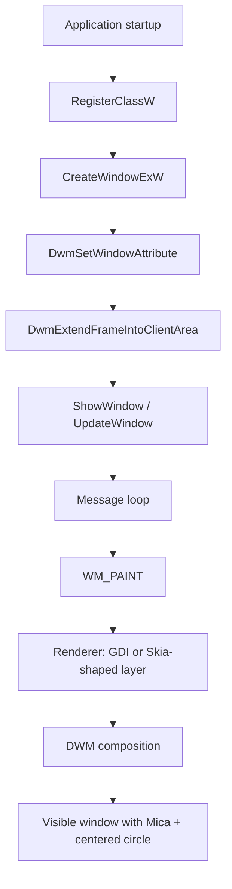
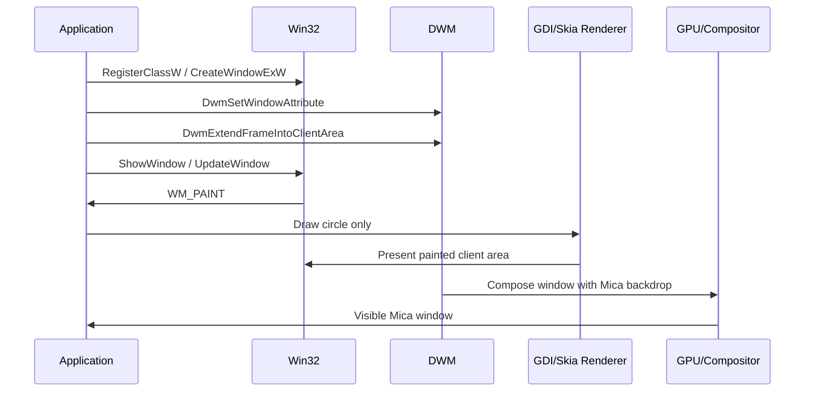

# Kotlin/Native Windows 11 Mica Rendering Guide

This document explains how the project's native Windows windowing layer produces a Windows 11 Mica surface with a centered circle, using both the GDI path (`MicaWindow`) and the Skia-shaped path (`SkiaMicaWindow`).

> Note: in this repository, the `org.jetbrains.skia.*` package is a small native rendering abstraction shaped like Skia APIs so the project can stay Kotlin/Native-only. The concepts below still map cleanly to a real Skia-backed UI framework.

## 1. Overview

Windows Mica is a system backdrop material introduced in Windows 11. It samples the user's desktop and theme context to produce a soft, dynamic, translucent-looking surface behind app content. It is not simple alpha transparency; it is a DWM-managed composition material.

The Desktop Window Manager (DWM) owns the final composition pass. When a window opts into a backdrop type, DWM renders the backdrop behind the window's client area and combines it with the app's content during composition.

Mica differs from acrylic and transparency:

- **Transparency** exposes whatever is behind the window, usually the desktop or another app.
- **Acrylic** adds blur and tint effects tied to the content behind the window.
- **Mica** is a wallpaper-adaptive, mostly opaque system material that uses the desktop context without acting like a plain alpha window.

In this project, the window host enables Mica, extends the DWM frame into the client area, and then draws only the centered circle, leaving the rest of the client area effectively transparent to DWM.

## 2. Architecture

The rendering flow is:

1. `main()` creates `SkiaMicaWindow` or `MicaWindow`.
2. The window class is registered with `RegisterClassW`.
3. A top-level Win32 window is created with `CreateWindowExW`.
4. DWM attributes are applied to request Mica and dark mode.
5. The frame is extended into the client area with `DwmExtendFrameIntoClientArea`.
6. The message loop dispatches `WM_PAINT`.
7. The renderer draws only the circle.
8. DWM composes the final frame and shows the Mica backdrop behind the content.

### Responsibilities

| Component | Responsibility |
| --- | --- |
| Win32 Window | Owns the native HWND, size, title bar, and client area. |
| Window Procedure (`WndProc`) | Receives messages, handles paint and theme changes, and triggers redraws. |
| DWM | Renders the system backdrop and composes the final desktop frame. |
| GDI or Skia renderer | Draws the circle and avoids opaque background painting. |
| Message Loop | Pumps messages until the window closes. |

### Architecture diagram



## 3. Window Creation

The Win32 window is created in `MicaWindow.run()` and `SkiaMicaWindow.run()`.

```kotlin
val wc = alloc<WNDCLASSW>()
wc.lpfnWndProc = staticCFunction(::skiaWindowProc)
wc.hInstance = hInstance
wc.lpszClassName = classNameW.ptr
wc.hCursor = LoadCursorW(null, IDC_ARROW)
wc.hbrBackground = null

RegisterClassW(wc.ptr)

val hwnd = CreateWindowExW(
    0u,
    className,
    title,
    WS_OVERLAPPEDWINDOW.toUInt(),
    CW_USEDEFAULT,
    CW_USEDEFAULT,
    800,
    500,
    null,
    null,
    hInstance,
    null
)

ShowWindow(hwnd, SW_SHOW)
UpdateWindow(hwnd)
```

### API details

- `RegisterClassW` registers a window class so Windows knows which procedure to call for messages.
- `CreateWindowExW` creates the actual top-level HWND.
  - `className`: must match the registered class.
  - `title`: caption shown in the title bar.
  - `WS_OVERLAPPEDWINDOW`: standard resizable window frame.
  - size and position: initial bounds.
  - `hInstance`: module instance for the class.
- `ShowWindow` makes the window visible.
- `UpdateWindow` forces an initial paint if needed.

## 4. Enabling Mica

`DwmSetWindowAttribute` configures DWM-managed features on an already-created window.

```kotlin
val backdrop = alloc<IntVar>()
backdrop.value = DWMSBT_MAINWINDOW
DwmSetWindowAttribute(
    hwnd,
    DWMWA_SYSTEMBACKDROP_TYPE,
    backdrop.ptr,
    sizeOf<IntVar>().convert()
)

val dark = alloc<BOOLVar>()
dark.value = if (isDarkModeActive()) 1 else 0
DwmSetWindowAttribute(
    hwnd,
    DWMWA_USE_IMMERSIVE_DARK_MODE,
    dark.ptr,
    sizeOf<BOOLVar>().convert()
)
```

### Attributes

- `DWMWA_SYSTEMBACKDROP_TYPE` selects the backdrop material.
- `DWMSBT_MAINWINDOW` requests Mica for a standard app window.
- `DWMWA_USE_IMMERSIVE_DARK_MODE` aligns caption colors and theme integration with the user setting.

### Why after creation?

These attributes apply to a valid HWND. The window must exist before DWM can attach visual state to it.

## 5. Extending the Frame

```kotlin
val margins = alloc<MARGINS>()
margins.cxLeftWidth = -1
margins.cxRightWidth = -1
margins.cyTopHeight = -1
margins.cyBottomHeight = -1
DwmExtendFrameIntoClientArea(hwnd, margins.ptr)
```

`DwmExtendFrameIntoClientArea` tells DWM to render the frame material into the client region.

When all margins are `-1`, DWM treats the entire client area as glass/backdrop-enabled. That is the key step that lets Mica show through the app's content region instead of being limited to only the title bar.

## 6. Rendering with GDI

The GDI path lives in the earlier `MicaWindow` implementation. It uses `WM_PAINT`, `BeginPaint`, and `EndPaint` correctly.

```kotlin
WM_PAINT.toUInt() -> memScoped {
    val ps = alloc<PAINTSTRUCT>()
    val hdc = BeginPaint(hwnd, ps.ptr)
    val rc = alloc<RECT>()
    GetClientRect(hwnd, rc.ptr)

    val width = rc.right - rc.left
    val height = rc.bottom - rc.top
    val radius = if (width < height) width / 4 else height / 4
    val left = (width / 2) - radius
    val top = (height / 2) - radius
    val right = (width / 2) + radius
    val bottom = (height / 2) + radius

    val bgBrush = CreateSolidBrush(rgb(0, 0, 0))
    FillRect(hdc, rc.ptr, bgBrush)
    DeleteObject(bgBrush)

    val pen = CreatePen(PS_SOLID.toInt(), 1, rgb(255, 255, 255))
    val brush = CreateSolidBrush(rgb(255, 77, 109))
    val oldPen = SelectObject(hdc, pen)
    val oldBrush = SelectObject(hdc, brush)
    Ellipse(hdc, left, top, right, bottom)
    SelectObject(hdc, oldBrush)
    SelectObject(hdc, oldPen)
    DeleteObject(brush)
    DeleteObject(pen)
    EndPaint(hwnd, ps.ptr)
    0L
}
```

### Paint lifecycle

- `WM_PAINT` means Windows wants the invalidated region redrawn.
- `BeginPaint` gives a paint HDC and validates the update region.
- The circle is drawn.
- `EndPaint` completes painting and releases the HDC.

### Circle geometry

- `width` and `height` come from `GetClientRect`.
- `radius = min(width, height) / 4` keeps the circle proportional.
- Center is `(width / 2, height / 2)`.
- Bounds are derived from center ± radius.

### GDI API roles

- `CreatePen`: outlines the circle.
- `CreateSolidBrush`: fills the circle.
- `Ellipse`: draws the circle/ellipse.
- `SelectObject`: selects pen/brush into the HDC.
- `DeleteObject`: releases GDI objects after use.

## 7. Rendering with Skia

`SkiaMicaWindow` uses a Skia-shaped renderer abstraction in this repository.

```kotlin
val info = ImageInfo.makeN32Premul(width, height)
val surface = Surface.makeRasterDirect(info, hdc)
val canvas = surface.canvas

canvas.clear(0)

val paint = Paint().apply {
    color = 0xFFFF4D6D.toInt()
    isAntiAlias = true
}
val radius = min(width, height) / 4f
canvas.drawCircle(width / 2f, height / 2f, radius, paint)
```

### Surface lifecycle

- `ImageInfo.makeN32Premul` describes the pixel format and size.
- `Surface.makeRasterDirect` binds the rendering surface to the window-backed draw target.
- `canvas` is the drawing surface used for commands.
- `Paint` stores circle color and anti-alias state.
- The renderer draws the circle and then returns control to Win32.

### Annotated concept

In a real Skia pipeline, the canvas would draw into a pixel buffer or GPU-backed surface. Here the abstraction is intentionally lightweight so the architecture remains Kotlin/Native-friendly.

## 8. Keeping the Background Transparent

Painting the client area with solid white or solid black can hide the backdrop if the renderer treats the result as opaque.

### Why GDI is tricky

GDI does not model alpha in the same way as modern GPU surfaces. If you fill the client area with opaque pixels, DWM has nothing transparent to show through.

### Correct approach

- Do not erase the background with white.
- Avoid opaque full-window fills.
- If using a Skia-like canvas, clear with transparent black when the backend supports alpha.
- Let DWM own the backdrop; draw only the circle.

### GDI vs Skia transparency

- **GDI**: transparency is mostly simulated by cooperating with DWM and avoiding opaque fills.
- **Skia**: a raster or GPU surface can preserve alpha more naturally, which is easier for compositing.

## 9. Message Loop

```kotlin
val msg = alloc<MSG>()
while (GetMessageW(msg.ptr, null, 0u, 0u) > 0) {
    TranslateMessage(msg.ptr)
    DispatchMessageW(msg.ptr)
}
```

### Calls

- `GetMessage` blocks until a message arrives.
- `TranslateMessage` converts keyboard input into character messages when needed.
- `DispatchMessage` sends the message to the window procedure.

Paint events are generated when Windows invalidates the client area or when `UpdateWindow` forces the initial paint.

## 10. Window Resize Handling

The circle remains centered because its bounds are derived from the current client size on every paint.

```kotlin
val width = rc.right - rc.left
val height = rc.bottom - rc.top
val radius = if (width < height) width / 4 else height / 4
val cx = width / 2
val cy = height / 2
```

### Math

- Center: `cx = width / 2`, `cy = height / 2`
- Radius: `min(width, height) / 4`
- Bounds: `[cx - radius, cy - radius, cx + radius, cy + radius]`

This keeps the circle proportional and centered after resize.

## 11. Rendering Pipeline

1. Application starts in `main()`.
2. `SkiaMicaWindow().run()` or `MicaWindow().run()` creates the HWND.
3. DWM attributes are applied.
4. The frame is extended into the client area.
5. Windows sends `WM_PAINT`.
6. The renderer draws only the circle.
7. DWM composites the client area with the Mica backdrop.
8. The final window appears on screen.



## 12. Comparison

| Aspect | GDI implementation | Skia implementation |
| --- | --- | --- |
| Rendering pipeline | Direct Win32 painting | Canvas-based rendering abstraction |
| Performance | Simple, CPU-based | More scalable if backed by real Skia |
| Hardware acceleration | No | Possible in a true Skia backend |
| Transparency support | Cooperative, limited | Better alpha/compositing model |
| Ease of implementation | Easiest | Cleaner API, more setup |
| Recommended use | Minimal native samples | Framework-style rendering layer |

## 13. Common Pitfalls

- Filling the background with white: hides the Mica effect.
- Clearing the canvas to an opaque color: makes the window look flat.
- Using an opaque framebuffer or swapchain: blocks backdrop composition.
- Misconfiguring DWM attributes: Mica never activates.
- Forgetting `DwmExtendFrameIntoClientArea`: backdrop stays outside client area.
- Child windows covering the client area: they paint opaque content over Mica.

## 14. Summary

The window works because the app cooperates with DWM instead of fighting it:

- Win32 creates the window and pumps messages.
- DWM is told to use a system backdrop and extend the frame.
- The renderer draws only the centered circle.
- The rest of the client area stays transparent enough for Mica to show through.

For a Kotlin/Native UI framework, this is the core pattern: let the window host and DWM handle composition, and keep your renderer focused on content instead of painting an opaque background.
